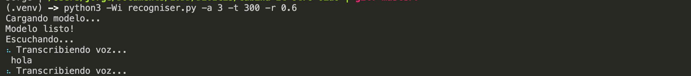

Software para piezas "Solo Habla" y parte de "Llegar a las manos",
para "Violencias del Decir" de Arturo Moya Villén.

Módulos:

- Reconocimiento y transcripción de voz
- (futuro: Análisis morfológico del texto obtenido por reconocimiento de voz)
- (futuro: Comunicación por UDP)

Funcionamiento:
1. opciones del script principal (recogniser.py), usa `python3 -Wi recogniser.py` con `--help` o `-h` para ver la siguiente ayuda:

	

2. en Terminal:
	```bash
	source ./setup.sh
	python3 -Wi recogniser.py
	```
	[ctrl + C] para detener el programa

3. ejemplo de uso con opciones:
